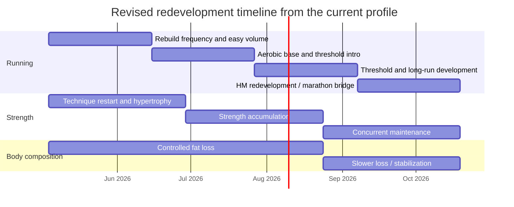
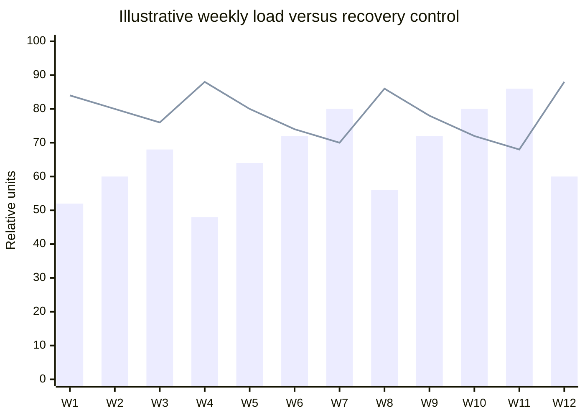

# API-Integrated Personalized Coach GPT Addendum

## Executive summary

The most important change introduced by your existing health-data pipeline is architectural, not cosmetic: the coach GPT should stop treating manual chat check-ins as the primary source of truth and instead use a read-only external action that pulls a compact, coach-ready summary from your API on demand. Current guidance from entity["company","OpenAI","ai company"] is explicit that GPT actions are configured through authentication plus an OpenAPI schema, that GPTs can use either apps or actions but not both at the same time, and that uploaded knowledge should be used for reference material while rules and workflow belong in instructions. citeturn6view0turn6view1turn5search1

Your sample summary is already useful enough to drive daily coaching decisions. It shows a favorable short-term direction in body mass, activity, and several recovery-related trends: the 28-day average body mass is about 91.14 kg versus about 90.09 kg over the most recent 7 days; steps, exercise minutes, and distance are all materially higher over the last week than over the last 28 days; resting heart rate is stable in the low 50s; HRV and wearable-estimated VO2max are modestly improved; and sleep has improved versus the 28-day baseline. At the same time, average sleep still sits at only about 391 minutes asleep per night over 7 days, which is roughly 6 hours 31 minutes and still below the usual 7–9 hour target associated with better recovery and performance outcomes. That means the GPT should read the current pattern as “good momentum, but not enough sleep to spend recklessly.” citeturn2search9turn2search29

Your 2018 half-marathon PB materially changes the long-range interpretation, but it does not eliminate the current gap. Using the Riegel endurance model, a current half marathon of 2:15 projects to roughly 4:41 for the marathon; your 2018 half-marathon PB of 1:42:30 projects to roughly 3:34; and a 3:00 marathon corresponds to a half-marathon equivalent of roughly 1:26. In plain terms: your past PB supports the idea that you are not building from zero, but sub-3 is still a multi-block redevelopment problem rather than a near-term race prediction. citeturn1search4turn7calculator0turn7calculator1turn7calculator2

That revised interpretation fits the detraining literature. Endurance markers can deteriorate quite quickly with long breaks or reduced training, especially VO2max and endurance capacity, but retraining is often faster than first-time development, and previously trained systems can regain strength and performance more rapidly than a true novice starting from scratch. Your historical PB therefore justifies a somewhat more optimistic **early** redevelopment curve, but not a shortcut around the volume, consistency, and fueling required for a real sub-3 marathon build. citeturn12search0turn12search1turn12search5

## What your live data should and should not drive

The strongest improvement to the GPT is not “more data.” It is **better triage** of which data are decision-driving, which are contextual, and which are too noisy to change training or nutrition on their own. Athlete-monitoring consensus supports using multidimensional monitoring rather than any single metric, and the wearables literature consistently shows that consumer devices are generally better for step count and heart rate than for energy expenditure or detailed sleep architecture, while bioelectrical-impedance body-composition outputs are strongly affected by hydration state. citeturn6view4turn9search10turn9search2turn9search5turn10view4

| Signal family from your feed | GPT trust level | Appropriate use | What the GPT should **not** do |
|---|---|---|---|
| Body mass rolling averages | High | Adjust weekly calories, assess fat-loss trend, detect stalls or overly rapid loss | React to a single-day fluctuation |
| Resting HR plus HRV trend | High | Readiness context, illness/overreach screen, recovery trend | Treat one isolated bad reading as decisive |
| Sleep total / asleep minutes | High | Downshift intensity when sleep debt is obvious | Over-interpret REM/deep/core stage minutes |
| Workout-specific running data | High if exposed separately | Pace setting, load progression, long-run planning | Infer run quality from steps alone |
| Workout-specific strength data | High if exposed separately | Progress loads, detect stalls, manage fatigue | Advance strength phases when logging is missing |
| Steps / stand minutes / daylight | Moderate | NEAT, routine consistency, behavior coaching | Substitute for formal run or recovery data |
| Respiratory rate, wrist temperature, SpO2 | Moderate | Illness/context checks when combined with symptoms | Diagnose illness or make training decisions alone |
| Wearable-estimated VO2max / cardio recovery | Low to moderate | Long-term trend only | Set race paces or predict race outcomes from one value |
| Body-fat %, muscle %, water %, body age | Low | Very broad trend context at best | Change calories or training because of daily movement |
| Active / resting calories from wearables | Low | Relative trend only | Set energy intake directly from device estimates |

This trust hierarchy reflects the athlete-monitoring consensus, the current wearables umbrella review, the systematic reviews on wearable validity, and the evidence that BIA-style body-composition estimates are distorted by hydration changes. citeturn6view4turn9search10turn9search2turn9search8turn9search1turn10view4

Your own sample already shows why quality flags matter. Several rows have missing `yesterday_value` fields; `cardio_recovery` appears perfectly flat across windows; and `hr_avg`, `hr_max`, and `hr_min` are identical on the sample date, which is possible but suspicious enough that the GPT should treat them as “check freshness / check source mapping” rather than blindly trusted facts. That is why the API needs explicit metadata for `last_sync_at`, `data_quality`, `is_imputed`, `source`, and `completeness_pct` rather than only numeric values.

## What the API should look like for coaching use

Your current row-wise daily summary is good for analytics and dashboards, but it is not the ideal **sole** payload for a coaching GPT. The reason is practical: training decisions depend on a blend of short-term trend, session detail, subjective context, and data quality. Monitoring consensus supports combining internal load, external load, health context, and outcome measures rather than relying on a thin summary layer. The best design is therefore to keep your current summary endpoint for analytics, while adding a second “coach-state” endpoint that gives the model the exact fields it needs without token-heavy repetition. citeturn6view4turn6view0turn6view1

| Recommended endpoint | What it should return | Why it matters to the GPT |
|---|---|---|
| `get_daily_summary(date)` | Your existing rollups, but in normalized JSON with units, source, freshness, and missingness | Keeps the current warehouse view available |
| `get_recent_workouts(days)` | Each run and lift for the last 7–14 days: type, duration, distance, pace, HR, intervals, RPE, and lift top sets / volume | Lets the GPT reason about real training load rather than steps |
| `get_coach_state(date)` | A compact, derived payload: phase, last key sessions, weight trend, sleep debt, HR/HRV deltas, readiness flag, pain flags, calorie adherence, and recommended “green / amber / red” state | This should be the default action the GPT calls first |
| `get_goal_state()` | Current goals, target dates, current bests, current estimated paces, current estimated e1RMs | Prevents the model from losing the big picture |
| `get_user_notes(days)` | Pain, soreness, hunger, GI issues, motivation, travel, illness notes | Objective data alone miss the most important subjective constraints |
| `get_plan_context()` | Current mesocycle, next deload, next race/test week, strength phase | Helps the GPT give phase-appropriate advice instead of generic advice |

The key inference from the research is that your API should expose **derived coaching variables**, not just raw metrics. Examples: `weight_rate_pct_bw_per_week`, `sleep_debt_7d`, `rhr_delta_vs_28d`, `hrv_delta_vs_28d`, `run_load_7d`, `strength_load_7d`, `deload_due`, `possible_underfueling_flag`, and `data_reliability_flag`. That is not because the model is incapable of arithmetic; it is because the coaching problem is fundamentally about consistent interpretation of the same logic across days and weeks. The monitoring literature strongly favors structured, multidisciplinary interpretation, and the current wearables literature makes a similar point: the noisier the measurement domain, the more valuable explicit confidence labeling becomes. citeturn6view4turn9search10turn9search1turn10view4

For deployment, the cleanest choice is a **private GPT with a read-only action** pointed at an internet-reachable HTTPS endpoint in front of your home system. The action layer needs authentication and an OpenAPI schema, and public GPTs with actions require a privacy policy URL and user approval behaviors. In practice, that makes a personal or workspace-shared GPT much cleaner for health data than a Store-published version. In managed workspaces, domain allowlists can also block actions entirely, so that needs checking before you commit to a deployment path. citeturn6view0turn6view1

## How the new information changes the training roadmap

Your historical performance matters most in the **first** redevelopment blocks. A 1:42:30 half marathon off relatively low prior running volume suggests that your ceiling is probably better than your current fitness implies, and the detraining literature supports the idea that some previously developed capacity can come back faster than it was first built. But marathon-specific success still depends on sustained volume, mostly easy running, and fatigue management. Large observational work in marathon runners shows that faster runners accumulate much more volume than slower runners and display a stronger pyramidal intensity distribution, while strength training—especially heavier loading and related methods—improves running economy and can coexist with endurance development when concurrent training is managed properly. citeturn12search0turn12search1turn1search10turn1search18turn3search3turn1search21turn1search13

| Performance anchor | Half-marathon marker | Marathon equivalent | What it means |
|---|---:|---:|---|
| Current baseline | 2:15:00 | ~4:41 | Current marathon-specific fitness is far from sub-3 |
| Historical PB | 1:42:30 | ~3:34 | Prior aerobic potential is materially better than the current baseline |
| Sub-3 target equivalent | ~1:26:20 | 3:00:00 | The fitness gap is still very large |

These equivalencies come from the Riegel model and should be treated as planning anchors, not promises; marathon predictions from shorter races are useful, but imperfect. citeturn1search4turn1search28turn7calculator0turn7calculator1turn7calculator2

A realistic near-term structure is therefore a **24-week redevelopment block**, not a direct sub-3 attempt.

| Weeks | Primary objective | Running emphasis | Strength emphasis | Fat-loss emphasis | API gate to advance |
|---|---|---|---|---|---|
| 1–6 | Rebuild routine and durability | 4–5 runs per week, mostly easy, long run 10–16 km | Reintroduce 2–3 full-body sessions, technique first | Moderate deficit, high protein | Stable body-mass trend, no persistent pain, sleep trending up |
| 7–12 | Aerobic base plus strength accumulation | Long run 14–20 km, one threshold touch, one hill/stride touch | Bench/squat/deadlift progressions start to matter | Continue loss if training quality stays intact | HR/HRV stable, no major fatigue flags, strength logging reliable |
| 13–18 | Threshold development and heavier lifting | 5–6 runs, long run 18–24 km, medium-long run introduced | 3 sessions if tolerated, otherwise 2 plus accessories | Deficit softens on hardest weeks | Tune-up 5K/10K/HM shows real improvement |
| 19–24 | Half-marathon redevelopment / pre-marathon bridge | One threshold session, one long run, race rehearsal fueling | Lower-body volume trimmed as run load rises | Weight loss slows or pauses if recovery suffers | Durable weeks at the top of the range and better race markers |

This phase table is an applied inference from the marathon intensity-distribution evidence, the concurrent-training literature, resistance-training progression models, and the need for gradual body-mass reduction during performance-focused training. citeturn1search10turn1search18turn3search3turn1search21turn0search1turn11search20turn0search8

A true 12-week sub-3-specific marathon block should be treated as a **later** module, only after a readiness gate is met. A reasonable practical gate is sustained 55–70+ km weeks, stable long runs of roughly 24–30 km, reliable fueling, and race markers that have moved into the low-1:30s half-marathon range or better. That is a coaching inference rather than a formal law, but it is far more defensible than pretending the current profile is already close enough for a sub-3 block. citeturn1search4turn1search10turn1search18turn8view3



The timeline above is deliberately conservative because faster marathoners still build performance mainly through greater low-intensity volume, and strength work should remain in the program because heavier strength training can improve running economy rather than simply competing with it. citeturn1search10turn1search18turn3search3turn1search21

## Prompt and interaction design updates

The GPT should now be redesigned around a **two-stage interaction**. First it calls the API and reads objective trend data. Then it asks only for the subjective inputs that the API cannot reliably know: pain, soreness, unusual stress, hunger, GI issues, motivation, and schedule disruption. That matches the monitoring literature much better than repeatedly asking you to retype data you already collect. citeturn6view4turn6view0turn6view1

```text
System prompt addendum for live-data use

Before giving any training or nutrition advice, call get_coach_state for the most recent complete date.

Treat these as primary decision metrics unless data_quality says otherwise:
- body-mass trend over 7 to 28 days
- sleep duration trend
- resting HR trend
- HRV trend
- recent run load
- recent strength load
- pain / injury / illness flags
- current mesocycle and next key session

Treat these as secondary or noisy metrics:
- body-fat percentage
- muscle percentage
- water percentage
- body age
- wearable calories
- wearable-estimated VO2max
- stage-level sleep breakdown

If the action payload is missing workout detail, pain status, hunger, GI status, or schedule changes, ask only for those missing items.

Never set calorie targets directly from wearable energy expenditure.
Never progress a lift if strength logging is absent or stale.
Never progress running intensity when sleep debt, pain flags, or recovery deltas are clearly adverse.
If data freshness or reliability is low, say so explicitly and downgrade confidence.

Default output:
1) Situation summary from live data
2) Training decision for today / this week
3) Nutrition adjustment
4) Recovery action
5) What to monitor next
6) Confidence and missing data
7) Evidence note
```

This prompt logic follows the official separation between instructions and knowledge in GPT construction, the action model for external APIs, and the sports-science preference for combining objective and subjective monitoring rather than over-trusting any one device metric. citeturn6view0turn6view1turn6view4

| What should be auto-filled from the API | What the GPT should still ask you |
|---|---|
| Body-mass trend, sleep trend, HR/HRV trend, steps, exercise minutes, movement trend, recent workouts, plan phase, deload proximity | Pain location and severity, soreness, motivation, hunger, GI tolerance, unusual stress, travel, schedule changes, whether a “missed workout” was deliberate or forced |
| Last benchmark times, current estimated paces, recent lifting exposure, current strength trend | Whether an upcoming session is important enough to protect even if fatigue is moderate |
| Data freshness and reliability flags | Whether sync failures occurred or a device was not worn |

The watch and scale can tell the GPT what happened physiologically only up to a point; adherence, pain, and context still need your words. That division is supported by the monitoring consensus and the limitations of consumer wearables. citeturn6view4turn9search10turn9search1

```text
Daily user prompt template

Use my latest coach_state and recent_workouts first.
Then ask me only these six questions if they are not already present:

1) Any pain, illness, or unusual fatigue today?
2) Soreness 0-10?
3) Hunger 0-10?
4) Stress 0-10?
5) Any GI issues or poor sleep not obvious from the data?
6) Any schedule changes that affect today’s session?

After that, give me:
- today’s training decision
- today’s calorie / macro emphasis
- one recovery priority
- one thing to watch
```

Because your API already captures objective trends, the daily interaction should become much shorter and much more targeted than a standard coaching chat. citeturn6view4turn6view0

## Safety and auto-adjustment rules

The automation layer should be conservative. Guidance from the entity["organization","American College of Sports Medicine","professional society"] on exercise screening, the 2023 RED-S consensus from the entity["organization","International Olympic Committee","sports governing body"], and current best-practice work on body composition all point in the same direction: performance coaching should escalate only when the health picture is acceptable, and body-composition manipulation should never override basic health and recovery signals. citeturn3search1turn1search3turn3search2

| If the API and your check-in show this pattern | The GPT should do this | Why |
|---|---|---|
| Body mass falling roughly 0.3–0.8% per week, training stable, sleep and recovery acceptable | Hold calories steady and keep progressing | Gradual loss is more compatible with performance than aggressive cuts |
| Body mass falling faster than about 1% per week, or performance and recovery worsen | Add energy back, mainly around key sessions | Slower athlete weight loss preserves performance and lean mass better |
| Two or more poor-sleep nights before a key run or heavy lower-body session | Downgrade intensity or convert to easy work | Sleep loss degrades recovery and performance |
| Resting HR elevated and HRV suppressed relative to baseline, plus soreness / fatigue | Make the day easy or rest, then reassess | Monitoring works best when trend changes across several markers agree |
| Body-fat %, muscle %, water %, or body-age jump for one day | Do nothing unless body mass and recovery trends agree | These values are noisy and hydration-sensitive |
| Strength volume absent or stale for more than a week | Hold progression and confirm whether lifting is paused or logging failed | Load progression without load data is guesswork |
| Focal bone pain, limping, chest symptoms, syncope, severe palpitations, marked illness signs | Stop progression and advise medical review | These are not “push through it” signals |

The decision logic above combines gradual athlete weight-loss guidance, sleep-performance evidence, athlete-monitoring consensus, and the practical limits of consumer body-composition and wearable outputs. citeturn11search0turn11search20turn2search9turn6view4turn10view4

Nutrition should also become **trend-driven rather than calorie-estimate-driven**. The watch-derived calorie fields are too noisy to set intake directly, so the GPT should anchor macros to body mass and session demand, then adjust only after looking at 7–14 day weight trend, hunger, and training quality. A solid automation rule is protein at roughly 1.6–2.4 g/kg/day during a fat-loss phase, carbohydrate scaled up on threshold, long-run, and double-session days, and hydration individualized rather than copied from a generic number. citeturn0search8turn11search1turn11search21turn11search20turn2search31turn9search5

| Day type | Protein | Carbohydrate | Fat | Automation note |
|---|---:|---:|---:|---|
| Rest / light day | 1.8–2.2 g/kg | 2–3 g/kg | 0.7–0.9 g/kg | Maintain deficit if recovery is good |
| Easy aerobic day | 1.8–2.2 g/kg | 3–4 g/kg | 0.7–0.9 g/kg | Moderate carb support |
| Threshold or heavy lower-body day | 1.8–2.2 g/kg | 4–6 g/kg | 0.6–0.8 g/kg | Protect session quality |
| Long-run / race-rehearsal day | 1.8–2.0 g/kg | 5–7 g/kg or higher as needed | 0.6–0.8 g/kg | Fuel before, during, and after |

These bands are best treated as the GPT’s default macro logic until your own trend data identify a better personal response. They align with the joint sports-nutrition statement and protein recommendations for athletes during weight loss. citeturn0search8turn11search1turn11search20

The supplement layer should stay narrow. The best-supported additions remain creatine monohydrate and carefully tested caffeine use, broadly consistent with position stands from the entity["organization","International Society of Sports Nutrition","nutrition society"]. Everything else should come later, if at all, after sleep, protein, carbohydrate timing, and logging consistency are already working. citeturn11search6turn11search7



The chart is an implementation guide for the GPT rather than a claim about your exact future weeks: three building weeks, one lower-load week, with readiness expected to recover when load deliberately drops. That pattern is consistent with training-load monitoring practice and with the need to protect adaptation during concurrent endurance, strength, and fat-loss work. citeturn6view4turn3search12turn2search9

## Execution Context

This addendum is designed to work in a private or workspace-shared custom GPT built in ChatGPT on the web, with **Actions** enabled for a read-only API and **Knowledge** enabled for the evidence files. It will work best if your Pi-backed service is exposed through an internet-reachable HTTPS endpoint with authentication and an OpenAPI schema, and if you keep the coaching rules in Instructions while storing the long research documents as Knowledge files. GPTs can use either apps or actions, not both, and uploaded knowledge works best when it is clear and text-forward. If you ever publish the GPT publicly, action-enabled GPTs require a privacy policy URL. Mermaid blocks will render only in environments that support Mermaid; otherwise they should be exported as images or treated as source specs. citeturn6view0turn6view1turn5search1

Validation status: all execution constraints satisfied.